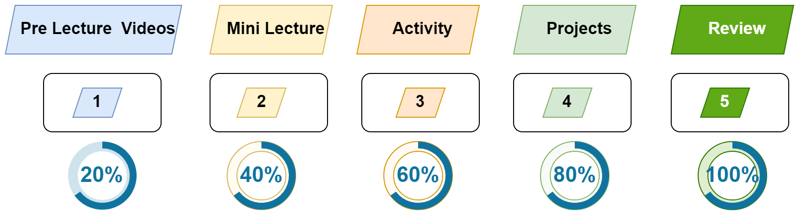

# Session 1: Introduction and Basics

> [!IMPORTANT]  
> - [Homework before Session 3](./material/Homework.md)
> - [Zoom Recordings](https://metropoliafi-my.sharepoint.com/:f:/g/personal/samiben_metropolia_fi/EramjTltA_BOni_R40opXRQBTQ1_gK6EWP2cbcX5G63ghA)

------

### How You'll Learn in This Course

We'll follow a 5-step learning cycle as shown in the figure below:

1. **Watch Pre-Lecture Videos**: Get a 20% grasp of the topic.
2. **Mini Lecture**: Increase your understanding to 40%.
3. **Pair Programming**: Collaborate to reach 60% comprehension.
4. **Apply Knowledge to the Project**: Deepen your understanding to 80%.
5. **Extra Digging**: Achieve full mastery, bringing your understanding to 100%.

-----
### Session Timeline 

- Morning:
  - Mini lecture (~35min)
  - `Break` (~15min)
  - Group Activity (~35min)
  - Mini lecture (~35min)
  - Group Activity (~35min)
- Lunch Break - 12:00 -13:00
- Afternoon
  - Mini lecture (~35min)
  - `Break` (~15min)
  - Pair programming (~35min)
  - Pair programming (~35min)

-----
### Topics

- Basic Server with Express.js
- CRUD (create, read, update, delete) operations
- Postman

-----
### Morning

- ~~Draw.io~~
- **Basic Server with Express.js**: We'll build Express.js servers with CRUD (create, read, update, delete) operations. We'll code from scratch and test the functionality using Postman.
  - [Summary](./material/crud.md)
  - [Activity 1: Array Manipulation](./material/crud-activity.md)
  - [Activity 2](./material/crud-activity2.md)

### Afternoon:

- **Postman**: You'll receive the code for two servers and learn how to interact with them using the four main `CRUD` operations: `create`, `read`, `update`, and `delete`. We'll use Postman to perform these operations. The code for the servers will be discussed in detail on Wednesday.
  - [Summary](./material/postman.md)
  - [Activity 1](./material/postman-activity.md)
  - [Activity 2](./material/postman-activity2.md) 
  
----

Links used in the Lecture

- https://excalidraw.com/
- 

  

<!-- links -->

<!-- 

> [!NOTE]  
> Highlights information that users should take into account, even when skimming.

> [!TIP]
> Optional information to help a user be more successful.

> [!IMPORTANT]  
> Crucial information necessary for users to succeed.

> [!WARNING]  
> Critical content demanding immediate user attention due to potential risks.

> [!CAUTION]
> Negative potential consequences of an action. 

-->